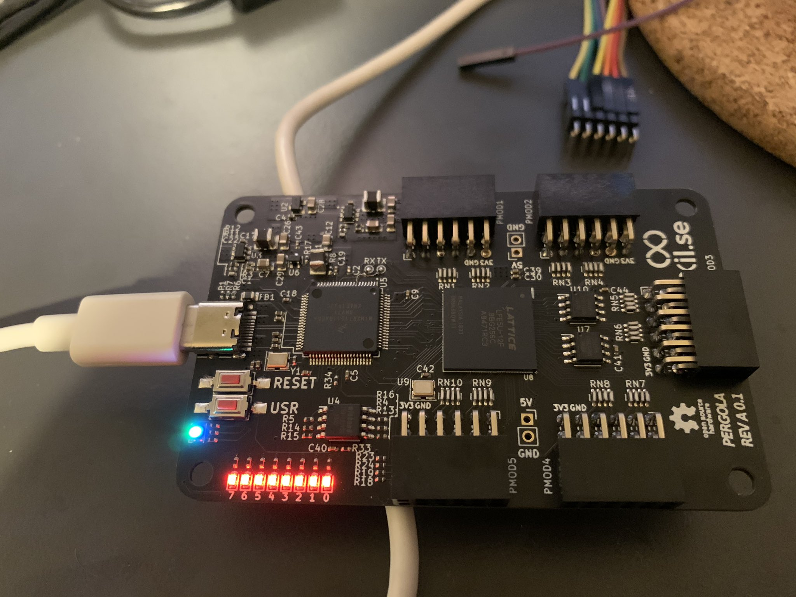

# Pergola FPGA

The Pergola FPGA board is a low-cost, open-source FPGA development board featuring the Lattice ECP5 FPGA.

# Current status

## RevA 0.1

A handful of units have been built for initial test and bringup populated with LFE5U-12F-8BG256C.

It has been tested and works if the fixes below are applied.

### Errata:

- iMX ROM bootloader freezes because the UART RX pin is pulled
   low by the FPGA during boot. (FPGA pin is PL35B_VREF_1_6)
   A 4K7 pull-up is probably not enough, the voltage drops to 2.9V.
   Workaround: Bodge a 1K pull-up between UART_RX and 3V3.
- Wrong load caps for the xtal. Should be 20pF.
- SWD IO and CLK are swapped on the silk.
- IMX_BOOT_MODE_0 and IMX_BOOT_MODE_1 are swapped on the silk.
- A 1K pull-down is on the ~FPGA_HOLD~ net to allow the iMX to use the flash exclusively during boot-up.

# Firmware
TODO.

Currently I have a very ugly test project that can be loaded into the iMX's RAM using the ROM bootloader. This will open up a CDC interface that can be used to send a bitstream to the FPGA.

Currently working on porting the UF2 bootloader in order to update the firmware easily using USB and not having to use the SWD pins.

# How to contribute

Feel free to submit a PR, create an issue.

Discussion happens on $TBD. You can ping [@kbeckmann](https://twitter.com/kbeckmann) on Twitter until this is sorted out.

